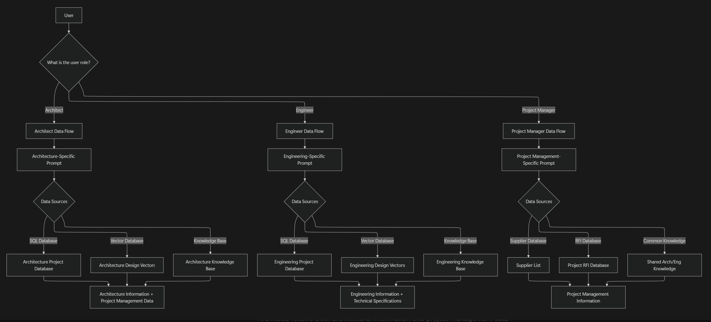
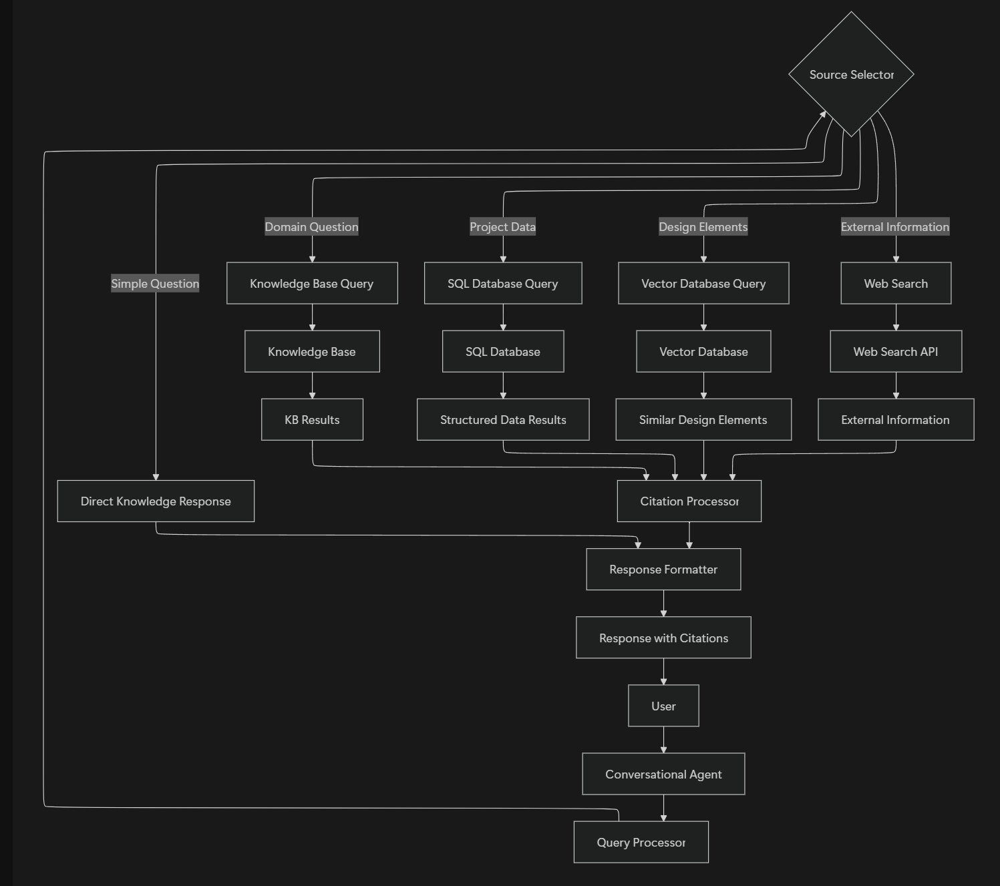
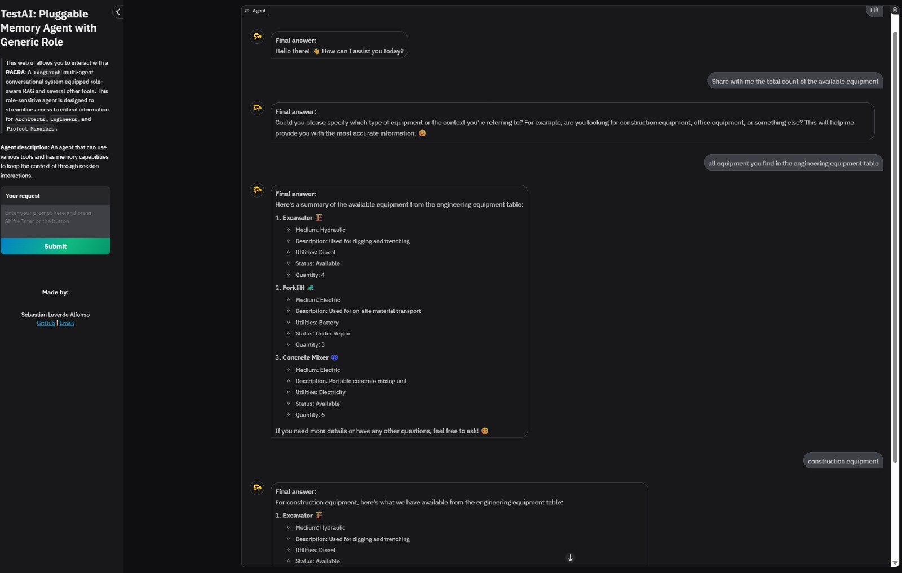
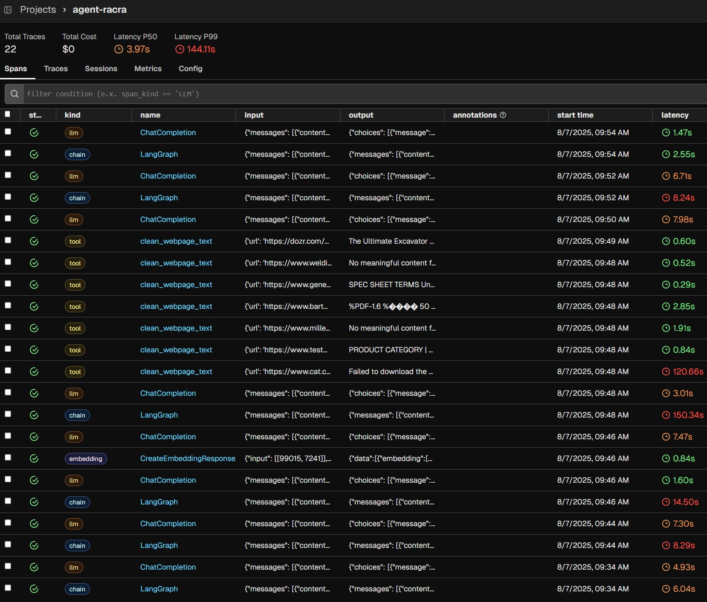

<h1 align="center">RACRA: Role-Aware Contextual Retrieval Agent</h1>

<p align="center">
  <a href="https://www.python.org/downloads/release/python-3120/" target="_blank" rel="noopener noreferrer">
    
  </a>
  <a href="https://creativecommons.org/licenses/by-nc-nd/4.0/" target="_blank" rel="noopener noreferrer">
    
  </a>
</p>

RACRA is a multi-agent conversational system equipped with a role-aware RAG and several other tools. This role-sensitive agent is designed to streamline access to critical information for **Architects**, **Engineers**, and **Project Managers**. By integrating multiple data sources and leveraging contextual reasoning, RACRA enhances productivity, decision-making, and knowledge sharing across complex project environments.

We are evaluating system workflows that balance agent autonomy with explicit control, ranging from fully autonomous agents with dynamic decision-making capabilities that reduce human oversight, to highly controlled state-graph-driven workflows that ensure predictable execution and strict compliance with organizational requirements. The key challenge is combining the adaptability of high-agency architectures with the reliability of deterministic routing by selectively constraining or expanding an agent's decision space based on task criticality, creating a hybrid model that remains flexible for unstructured scenarios while maintaining rigidity where precision and governance are essential.

The most determinist yet agentic workflow is represented as a fully routed, role-specific pipeline in which the user’s role determines a tailored data flow. Each role, Architect, Engineer, or Project Manager, engages with dedicated prompts and queries distinct, relevant databases such as SQL project repositories, vector design stores, and knowledge bases. This structured yet role-adaptive routing ensures that information retrieval and decision support are precisely aligned with the responsibilities and data needs of each stakeholder, thereby maximizing efficiency and contextual relevance across the project lifecycle.

The following diagram illustrates such a workflow:



The base system could be plugged with additional self-reflection, correction, and rephrasing cycles to increase the accuracy once evaluation metrics are set in place.

The source router with RAG could be easily extended to support several static knowledge bases as seen better below:

"

The agentic system is also capable of retrieving real-time information from the web, such as the latest news, weather, or stock prices, using the `web_insight_scraper` tool and `unified_text_loader` to load several document formats from the local path or urls targets. This allows the agent to provide up-to-date information and insights to users.

### 🛠️ Tools description

- **search_project_supabase**: Retrieves information from the Supabase database, which contains project-related data such as specifications, schedules, and budgets.
- **web_insight_scraper**: Scrapes web pages for real-time information, such as news, weather, or stock prices.
- **unified_text_loader**: Loads and processes various document formats (PDF, DOCX, TXT, PNG, XLSX, CSV and more) from local paths or specific target URLs to scrape information from, enabling the agent to access and analyze diverse content types.

---

## 👥 Role-Based Intelligence

RACRA understands and tailors its responses based on the user’s role/task:

### 👷 Engineer
- Access to technical specifications, system details, and engineering-focused data  
- Prioritized sources: technical documents, system blueprints, and spec sheets

### 🏛️ Architect
- Receives both design insights and project management data  
- Prioritized sources: design pattern repositories, schedules, budget allocations, and status reports

### 📋 Project Manager
- Access to supplier information, RFIs, and shared organizational knowledge  
- Prioritized sources: Suppliers Database, RFI Database, and Common Knowledge Base (shared architect/engineer knowledge)

---

## 📦 Requirements

Install the required packages using pip:

```bash
pip install .
```

## 🛠️ Usage

- Insert API keys in the `.env` file (`OPENAI_API_KEY`, `TAVILY_API_KEY`, `SUPABASE_URL`, `SUPABASE_SERVICE_KEY`)

- You can execute the tools in the `src/tools` directory to test them individually using the `--test_switcher` (A, B, or C) flag:

```bash
python src/tools.py --test_switcher A 
```

- To run the RACRA agent in demo mode (conversation with memory and tool calls), use the following command:

```bash
python src/agents.py --execution_mode demo 
```

- To run the RACRA agent in interactive mode (ui), use the following command:

```bash
python src/agents.py --execution_mode ui 
```

The gradio ui will open in your browser, allowing you to interact with the agent and see user and assistant messages.
The terminal output will display a more complete log with conversation turns, user queries, tool-calls and responses.


By default the agent and application will stream the responses (`streaming=True`), but you can disable this behaviour by adding the `--streaming` flag:

```bash
python src/agents.py --execution_mode ui --streaming False
```

The following is a screenshot of a user interacting with the agent through the gradio UI. The user intention triggers a RAG response:



---

## 📡 API Usage

This is a locally deployed FastAPI server that wraps an LLM agent powered by LangChain, with tool support and optional streaming responses.
The API provides two endpoints for interacting with the agent:

- `POST /invoke`: Returns a single full response.
- `POST /invoke-streaming`: Streams the response incrementally using Server-Sent Events (SSE).

---

#### ✅ Health Check

Check if the server is running:

```bash
curl http://localhost:5000/health
```

Expected response:

```json
{"status": "healthy"}
```

---

#### 🧠 Ask a Question (Full Response)

```bash
curl -X POST \
  http://localhost:5000/invoke \
  -H 'Content-Type: application/json' \
  -d '{
    "question": "What tools are you using?"
  }'
```

Expected response:

```json
{"result": "I'm using tools like search_project_supabase, web_insight_scraper, and unified_text_loader."}
```

---

#### 🔄 Ask a Question (Streaming Response)

```bash
curl -N -X POST \
  http://localhost:5000/invoke-streaming \
  -H 'Content-Type: application/json' \
  -H 'Accept: text/event-stream' \
  -d '{
    "question": "Give me a brief overview of your capabilities"
  }'
```

> Use `-N` to disable buffering so you see the streamed response in real time.

---

#### 📝 Notes

- Make sure your `.env` file is configured with all necessary environment variables (e.g., `OPENAI_API_KEY`, `PHOENIX_API_KEY`).
- Run the server with:
  ```bash
  python streaming_api.py
  ```

---

## 🧭 Observability

This project includes full observability support using [Arize Phoenix](https://arize.com/docs/ax), with OpenTelemetry-based **tracing**, **instrumentation**, and **monitoring**. Application performance, agent behavior, and system-level events are captured and exported to the Phoenix cloud platform via the configured `PHOENIX_COLLECTOR_ENDPOINT`. This enables real-time inspection, debugging, and evaluation of LLM-driven workflows through the Phoenix UI. You need to set your environment variable `PHOENIX_API_KEY` to your Arize Phoenix API key to enable observability.

Here is a screenshot of the traces captured by Arize Phoenix:



---
## 📎 License

This work is licensed under a
[Creative Commons Attribution-NonCommercial-NoDerivs 4.0 International License][cc-by-nc-nd].

See [`LICENSE`](./LICENSE) for details.

[![CC BY-NC-ND 4.0][cc-by-nc-nd-image]][cc-by-nc-nd]

[cc-by-nc-nd]: http://creativecommons.org/licenses/by-nc-nd/4.0/
[cc-by-nc-nd-image]: https://licensebuttons.net/l/by-nc-nd/4.0/88x31.png
